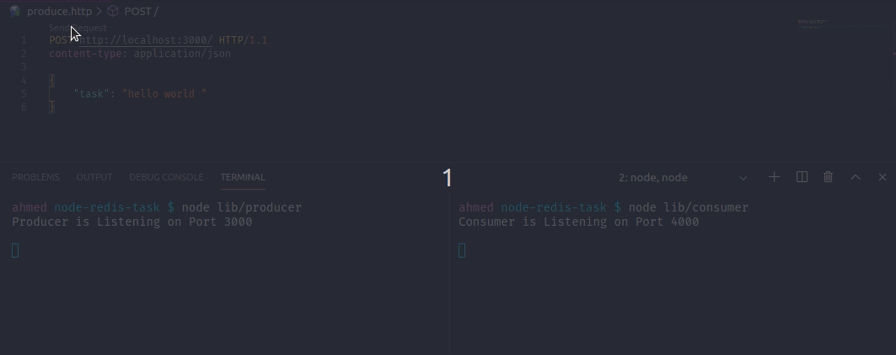

# Task Scheduler Using Redis and NodeJs



## Using Redis as a Task Scheduler

### Redis Setup

Install on Ubuntu:

```
sudo apt install redis
```

### Redis Techeniques

#### Redis Queue

It is a shared list that you can push or pop from anyside (left or right)

#### RPUSH

[rpush](https://redis.io/commands/rpush) (right push) is to create a queue if it doesn't exist and add the provided element to the end of that queue.

#### BLPOP

[blpop](https://redis.io/commands/blpop) (blocking left pop) is to block the promise while the queue is empty, i.e. keep listening until an element is pushed, otherwise the first element of the queue would pop up and the promise would resolve.

---

## Redis Manger Class

Since the redis API does not provide asynchronous functions, I built a well defined abstract class that will provide promisified version of the API functions using the built in node `promisify` utility .

Currently It contains promisified version of `blpop`, `rpush` redis functions.

`rpush` promisified e.g.
```typescript
const producer = promisify(RedisManger.redisClient.rpush).bind(
	RedisManger.redisClient
);
```

## Producer Service

The producer uses redis `RPUSH` techenique to add a task to our queue

```typescript
try {
	// get the task from the body
	const task = JSON.stringify(req.body.task);

	// create a queue if does not exist and push the task to its end
	await RedisManger.producer(process.env.QUEUE_NAME, task);

	// notify that the task is produced
	console.info(`${task} is produced successfully`);
} catch (err) {
	console.error(err);
}
```

## Consumer Service

The Consumer uses redis `BLPOP` techenique to listen untill the queue has a task, then consume that task.

The consumer uses the `BLPOP` technique recursively, as the `BLOP` promise resolves after the first consumption only, and wouldn't listen again, so we would restart it after each consumption to keep it alive.

```typescript
const consumeTask = async () => {
	let task;
	try {
		// get the consumed task from the selected queue
		// the 0 param means never timeout
		task = await RedisManger.consumer(process.env.QUEUE_NAME, 0);

		// use try and catch to make sure that the consume task
		// will keep alive
		try {
			// the first element of the array is the queue name, 
			// while the second is the content
			doWork(task[1]);
		} catch (err) {
			console.error(err);
		}
		
		// the consumer exists after consumtions, 
		// so recusrive calling keeps the consumer alive
		return consumeTask();
	} catch (err) {
		console.error(err);
	}
};
```
